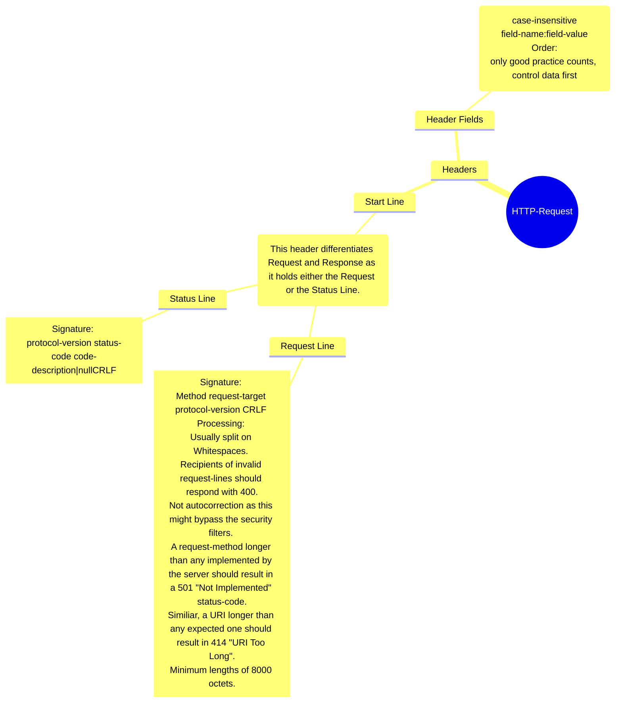

GET / HTTP/1.1 

Host: 127.0.0.1

Connection: keep-alive

Cache-Control: max-age=0

sec-ch-ua: "Not/A)Brand";v="99", "Google Chrome";v="115", "Chromium";v="115"

sec-ch-ua-mobile: ?0

sec-ch-ua-platform: "Windows"

DNT: 1

Upgrade-Insecure-Requests: 1

User-Agent: Mozilla/5.0 (Windows NT 10.0; Win64; x64) AppleWebKit/537.36 (KHTML, like Gecko) Chrome/

115.0.0.0 Safari/537.36

Accept: text/html,application/xhtml+xml,application/xml;q=0.9,image/avif,image/webp,image/apng,*/*;

q=0.8,application/signed-exchange;v=b3;q=0.7

cp-extension-installed: Yes

Sec-Fetch-Site: none

Sec-Fetch-Mode: navigate

Sec-Fetch-User: ?1

Sec-Fetch-Dest: document

Accept-Encoding: gzip, deflate, br

Accept-Language: de-DE,de;q=0.9,en-US;q=0.8,en;q=0.7