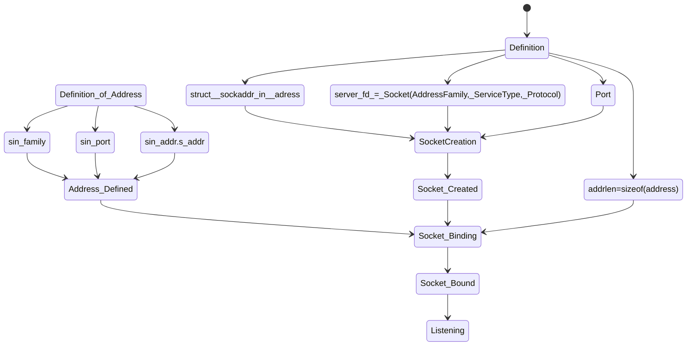

# Ablauf des SocketServers


* Address Family: internetwork (TCP, UDP), andere
* ServiceType: Stream, Datagram, Raw 
* Stream: Keine Grenzen für Datenströme, daher müssen Prozesse sich selbst auf Grenzen verständigen, zum Beispiel indem die Länge der Nachricht zuerst gesendet wird und dann die Nachricht.
* Datagrams: Verbindungslos, unabhängige Pakete, keine Garantien. Maximumlänge ist 65535.
* Raw: Direkten Zugriff auf IP oder ICMP Protokolle, welche tiefer liegen. Um neue Protokolle zu testen.
* in_addr: IPv4 Internet address 4*8Bits

```mermaid
classDiagram
    note for sockaddr_in "Address Families can be TCP/UDP, but there are a lot of others. It is an Integer \n IN_ADDR is IPv4 Internet-Addresse 4*8Bits"
    
    class sockaddr_in{
        ADDRESS_FAMILY sin_family;
        USHORT sin_port
        IN_ADDR sin_addr
        CHAR sin_zero[8]
    }
    class socket {
        INT AddressFamily
        INT ServiceType 
        INT Protocol 
    }
    ```

